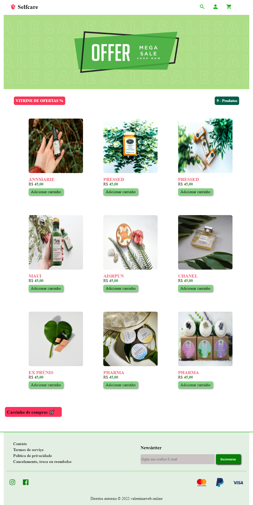

# Vitrine de Loja, com carrinho de compras

<h1 align="center" style="color:green">
selfcare</h1>
 
   
   
   

  

# Desafio
Esse  desafio foi construir uma página para exibição de produtos com carrinho de compras , de uma loja online chamada <strong>selfcare</strong>.   

# Techs: 
HTML 
CSS 
JAVASCRIPT 
Framework ou linguagem que preferir

# Como começar:
1 - Use esse template (clicando em Use this template) ou faça um fork deste repositório com o código inicial 
2 - Leia as instruções no readme.md 
3 - Comece a codar! 
4 - Compartilhe seu resultado com a comunidade :) 

# Requisitos:
- Sua página deve se parecer o mais próximo possível do design 
- Sua página deve ser responsiva 

# Design:
Modelo está disponível na pasta `./design` 
Imagens estão disponíveis na pasta `./assets` 

# Fonte utilizada:
- Lato

